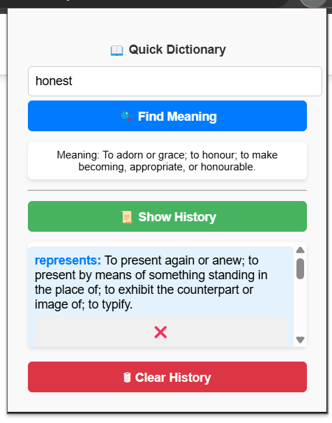

📖 Dictionary Chrome Extension
A simple Chrome Extension that allows users to search for word meanings, store their search history, and manage the stored words efficiently.

🚀 Features
✅ Search for word definitions instantly
✅ Stores search history
✅ Allows users to delete individual words from history
✅ Provides a Clear History option
✅ Simple and clean UI with an optimized layout

🛠 Installation Guide
Follow these steps to load the extension into Google Chrome:

Download the project

Clone the repository:
sh
Copy
Edit
git clone https://github.com/ManishSamarium/Dictionary_extension.git
Or manually download the ZIP and extract it.
Open Chrome Extensions page

Open Google Chrome and go to:
arduino
Copy
Edit
chrome://extensions/
Enable Developer Mode

Toggle "Developer mode" (top-right corner).
Load the Extension

Click "Load unpacked"
Select the extracted project folder
Done! 🎉

The extension is now installed and can be accessed via the Chrome Extensions toolbar.

🖥️ Usage
Search for a word

Type the word in the input box
Click the Search button
The definition will be displayed
View Search History

Click "Show History" to see past searches
Delete a Word

Click the small "Delete" button next to any word to remove it
Clear All History

Click "Clear History" to erase all stored words

🔗 API Used
This extension fetches word definitions from the Free Dictionary API:
🔗 https://dictionaryapi.dev/

Apearance 

Author- Manish Kumar
Email- sam68iiitr@gmail.com